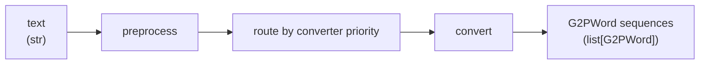

# G2P (Grapheme-to-Phoneme)

A multilingual grapheme-to-phoneme pipeline that converts raw text into phoneme sequences.

## Pipeline



| Stage      | Input                | Output                       | Purpose                                                   |
|------------|----------------------|------------------------------|-----------------------------------------------------------|
| Preprocess | raw text as `[text]` | `list[str]` fragments        | Clean text; keep fragment boundaries |
| Route      | each fragment       | claimed text ranges         | Higher-priority converters claim ranges first |
| Convert    | claimed `str`       | `list[G2PWord]`              | Split internally and generate complete pronunciation paths |

All fragments are routed before pronunciation conversion begins.

### Words, readings, paths, and groups

```python
from dataclasses import dataclass
from typing import TypeAlias

@dataclass
class G2PGroup:
    script: str
    phonemes: list[str]

G2PPath: TypeAlias = list[G2PGroup]

@dataclass
class G2PReading:
    paths: list[G2PPath]

@dataclass
class G2PWord:
    text: str
    language: str | None
    readings: list[G2PReading]
```

Converters determine semantic word boundaries and may return zero or more words
for a claimed text range. A reading groups complete legal
phoneme realizations; each path is an ordered list of contiguous
pronunciation groups. Each group owns its pronunciation script and phonemes.
Different paths can have different group counts, boundaries, and scripts.

An empty path represents an empty pronunciation. Empty groups are not retained.
`paths=[]` means no alternatives, whereas `paths=[[]]` contains one empty alternative.
There is no separate `G2PReading.script`: the scripts belong to each path's groups.

Converter-local preprocessors and converters may change word count and text.
`G2PWord.text` is supplied by the converter; the pipeline preserves that text and
stamps the resolved language on every returned word.

## Architecture

### Registry

Components are registered via decorators and looked up by ID at construction time.

```python
from g2p.registry import preprocessor, converter

@preprocessor(id="my-preprocessor")
class MyPreprocessor(Preprocessor): ...

@converter(id="my-converter", language="eng")
class MyConverter(Converter): ...
```

`language` is a comma-separated string (e.g. `"zh,cmn"`) stored as `tuple[str, ...]` on the class.

### Auto-discovery

Dropping a `.py` file into `g2p/preprocessors/` or `g2p/converters/` automatically imports it and fires the decorator.

```
g2p/
├── registry.py         # @preprocessor, @converter + lookup + parse_language()
├── pipeline.py         # G2PPipeline: preprocess, route, convert, assign language
├── api.py              # build_*_from_config(root_path=)
├── preprocessors/
│   ├── base.py         # Preprocessor ABC
│   └── simple.py       # FilterPunctuation, LowercasePreprocessor, StripWhitespacePreprocessor, RemoveAccentsPreprocessor
└── converters/
    ├── base.py         # Converter ABC, G2PWord, G2PReading, G2PGroup, G2PPath, G2PConversionError, resolve_language()
    ├── paradigm.py     # LexiconConverter, PronunciationScriptConverter
    ├── dictionary.py   # load_pronunciation_dict(), DictionaryConverter, PronunciationScriptDictionaryConverter
    ├── chinese.py      # MandarinConverter (id=chinese-pinyin), CantoneseConverter (id=cantonese-jyutping)
    ├── japanese.py     # JapaneseKanaConverter (id=japanese-kana), JapaneseMecabConverter (id=japanese-mecab)
    ├── lstm.py         # LSTMConverter (id=lstm) — ONNX encoder-decoder OOV
    ├── simple.py       # PassthroughConverter, CharPhonemeConverter
    ├── text.py         # Shared character matching and word boundaries
    └── cpp_pinyin/     # PinyinEngine + dicts (mandarin, cantonese)
```

### Preprocessor

Transforms `list[str]` fragments, starting from `[raw_text]`. Each resulting
fragment is routed independently. Converter-local preprocessors receive
`[claimed_text]`; their output fragments stay with the selected converter.

**Built-in:**

| ID                  | Class                         | Behavior                                             |
|---------------------|-------------------------------|------------------------------------------------------|
| `filter-punctuation` | `FilterPunctuation`           | Split tokens on punctuation and discard punctuation chars |
| `lowercase`         | `LowercasePreprocessor`       | Lowercase all tokens                                 |
| `strip-whitespace`  | `StripWhitespacePreprocessor` | Strip whitespace, remove empty tokens                |
| `remove-accents`    | `RemoveAccentsPreprocessor`   | Decompose accented chars and strip combining marks   |

### Converter

Each converter implements:

- `find(text: str) -> tuple[int, int] | None` — earliest accepted non-empty range,
  using Python string indices and half-open bounds; no pronunciation inference
- `convert(text: str) -> list[G2PWord]` — split and convert the claimed text
- `preprocessors() -> list[Preprocessor]` (optional) — private preprocessing

Converters use internal methods or ordinary functions in `converters/text.py`
for splitting. Word-based converters match complete words, never dictionary
substrings inside an English word. Chinese and Kana converters retain character
and kana-digraph boundaries; MeCab supplies its own word boundaries.

`Converter.language` is a class attribute `tuple[str, ...] | None`. The pipeline resolves which specific tag matched and stamps it on each `G2PWord.language`. Converters with `language=None` leave the field `None`.

**Built-in converters:**

| ID                   | Class                  | Behavior                                                                     |
|----------------------|------------------------|------------------------------------------------------------------------------|
| `dictionary`         | `DictionaryConverter`  | Pronunciation dictionary lookup from a tab-separated file                    |
| `passthrough`        | `PassthroughConverter` | Catch-all: returns each token as its own phoneme                             |
| `characters`         | `CharPhonemeConverter` | One-to-one character-to-phoneme mapping                                      |
| `chinese-pinyin`     | `MandarinConverter`    | hanzi → pinyin (cpp-pinyin engine) → phonemes (dict)                         |
| `cantonese-jyutping` | `CantoneseConverter`   | hanzi → jyutping (cpp-pinyin engine) → phonemes (dict)                       |
| `japanese-kana`      | `JapaneseKanaConverter`| kana → romaji (cpp-kana-aligned table) → phonemes (dict). Handles yōon digraphs, gemination |
| `japanese-mecab`     | `JapaneseMecabConverter`| kanji/kana runs → MeCab words → UniDic pronunciation candidates → existing kana converter |
| `lstm`               | `LSTMConverter`        | LexiconConverter with ONNX encoder-decoder inference for OOV words           |

### Japanese Kana converter

Extends `PronunciationScriptDictionaryConverter`. Splits kana text internally,
keeping digraphs like きゃ together, maps to romaji via a table matching cpp-kana,
then looks up the dictionary.

Key behaviors:
- っ → `"cl"`, を → `"o"`; ー and ゜ produce empty phonemes
- Katakana auto-converted to hiragana before lookup
- `find()` accepts continuous kana ranges
- `double_written_sokuon: bool = False` — gemination: `cl` + consonant → duplicate consonant (e.g. っか → k, ka)
- `script_to_paths` returns complete paths whose groups carry the romaji script and dictionary phonemes. An empty script returns `[[]]`; a geminated consonant produces a one-phone group.

### Japanese MeCab converter

`japanese-mecab` (`ja`, `jpn`) segments kanji/kana text with MeCab and enumerates
UniDic pronunciation candidates for each word. It reuses `JapaneseKanaConverter`
to produce complete paths with romaji group labels.
Pure kana without a UniDic pronunciation falls back to kana-sized words
(digraphs stay together), using `JapaneseKanaConverter`.

Requires optional dependencies, imported on first conversion:

```shell
python -m pip install "fugashi>=1.3,<2" "unidic>=1.1,<2"
```

Parameters:

- `dict_path: str` — required romaji-to-phoneme dictionary.
- `nbest: int = 32` — number of MeCab analyses to examine for each word.
- `double_written_sokuon: bool = False` — duplicate the following consonant for
  gemination, combining adjacent words when needed.
- `unidic_dir: str | None = None` — optional full UniDic directory; defaults to
  the installed `unidic` package's dictionary.

The default UniDic dictionary downloads automatically on first use if missing;
a custom `unidic_dir` must already be installed. Use `languages=["ja"]` or
`["jpn"]` to avoid Chinese converters claiming kanji in the reference config.
Romaji uses the dictionary fallback; numeric readings are unsupported.

### LSTM Converter

Extends `LexiconConverter`. Dictionary lookup first, ONNX encoder-decoder inference for out-of-vocabulary words.

Parameters:
- `dict_path: str | None` — optional pronunciation dictionary
- `model_path: str` — directory with `encoder.onnx`, `decoder.onnx`, `char.json`, `phonemes.json`

`find()` accepts the earliest complete word found in the dictionary or composed
entirely of characters in the model vocabulary. ONNX sessions are lazily loaded
on first pronunciation inference.

### Paradigms

Paradigm base classes live in `paradigm.py` and `dictionary.py`. They are **not** registered — subclasses add the `@converter` decorator.

**`PronunciationScriptConverter`** — for writing systems that use a decoupled pronunciation script (pinyin, jyutping, romaji). Two-phase:

1. `text_to_scripts(words) → list[list[str]]` — text → script tokens (with alternatives)
2. `script_to_paths(script) → list[G2PPath]` — a reading script → complete grouped paths

Both methods are abstract. `convert(text)` splits internally and requires one
script list per resulting word. It deduplicates identical paths within each
reading, comparing every group's script and phonemes. The intermediate script
string is not stored separately on the reading.

**`PronunciationScriptDictionaryConverter`** — extends `PronunciationScriptConverter`. Fills in `script_to_paths` via `load_pronunciation_dict()`. Subclasses implement `text_to_scripts` and pass a required `dict_path` to the constructor.

**`LexiconConverter`** — for alphabetical languages where text IS the pronunciation script. Has a pronunciation dictionary for known words and an abstract `infer_oov(token)` method for out-of-vocabulary inference. `dict_path` is optional (pure inference is valid).

### Language resolution

When the pipeline runs with `languages=["cmn"]`:

1. Converters are filtered: a converter runs if `language is None` or any of its tags are in the set.
2. For each converter, `resolve_language(converter.language, language_set)` picks the single matching tag (or first tag when no filter is set).
3. The tag is stamped on each output `G2PWord.language`.

### Convert algorithm

For each preprocessed fragment, the highest-priority matching converter claims
its earliest range. The left remainder passes to lower priorities; the right
remainder continues at the same priority. Claimed ranges cannot be crossed or
overridden, even if conversion later returns no words.

Routing uses an explicit stack. All unrecognized non-whitespace ranges are
reported in text order through `G2PConversionError` before conversion starts.
Conversion failures propagate; they do not trigger another converter.

Claimed ranges are converted in text order after local preprocessing. The pipeline
assigns language tags and preserves converter-produced text. `G2PWord.text` is
the normalized word surface, not a reconstruction of unprocessed input.

### DictionaryConverter format

Tab-separated file: `<word>\t<ph1> <ph2> ...`

- Multiple pronunciations via duplicate entries or `(N)` / ` (N)` suffixes: `word`, `word(1)`, `word (2)`
- Case-insensitive
- All pronunciation variants are preserved in `paths`

```
hello	hh ax l ow
hello(1)	hh eh l ow
world	w er l d
```

### Shared dictionary loader

`load_pronunciation_dict(path)` in `dictionary.py` loads a tab-separated file and returns `dict[str, list[list[str]]]`. Used by `DictionaryConverter`, `PronunciationScriptDictionaryConverter`, `LSTMConverter`, and any custom converter that needs script-to-phoneme lookup. No `(N)`-variant handling — that's `DictionaryConverter`-specific.

## Configuration

Reference config at `configs/g2p.yaml`:

```yaml
binarizer:
  g2p:
    preprocessors:
      - id: filter-punctuation
      - id: strip-whitespace
      - id: lowercase
    converters:
      # Chinese: hanzi
      - id: chinese-pinyin
        kwargs:
          dict_path: "dictionaries/ds-zh-pinyin-lite.txt"
      # Chinese: pinyin (direct dictionary fallback)
      - id: dictionary
        language: zh
        kwargs:
          dict_path: "dictionaries/ds-zh-pinyin-lite.txt"
      # Japanese: kanji + kana (filter with languages=["ja"] or ["jpn"])
      - id: japanese-mecab
        kwargs:
          dict_path: "dictionaries/japanese_dict_full.txt"
          nbest: 32
          double_written_sokuon: false
      # Japanese: romaji (direct dictionary fallback)
      - id: dictionary
        language: ja,jpn
        kwargs:
          dict_path: "dictionaries/japanese_dict_full.txt"
      # English: dictionary + LSTM OOV
      - id: lstm
        language: en
        kwargs:
          dict_path: "dictionaries/ds_cmudict-07b.txt"
          model_path: "assets/LstmG2p-Eng"
```

### Config schema

```python
class G2PPipelineConfig(ConfigBaseModel):
    preprocessors: list[PreprocessorConfig]
    converters: list[ConverterConfig]

class PreprocessorConfig(ConfigBaseModel):
    id: str
    kwargs: dict

class ConverterConfig(ConfigBaseModel):
    id: str
    language: str | None = None   # comma-separated, overrides decorator default
    kwargs: dict
```

`language` on `ConverterConfig` is **required** when the converter class has no registered language (`cls.language is None`). It overrides the decorator default when set.

`@`-prefixed strings in kwargs resolve relative to `root_path`: `"@../dicts/eng.txt"` with `root_path="configs/g2p/"` → `configs/dicts/eng.txt`.

## Programmatic usage

```python
from g2p import G2PPipeline
from g2p.preprocessors.simple import LowercasePreprocessor
from g2p.converters.dictionary import DictionaryConverter
from g2p.converters.simple import PassthroughConverter

pipeline = G2PPipeline(
    preprocessors=[LowercasePreprocessor()],
    converters=[DictionaryConverter(dict_path="dict.txt"), PassthroughConverter()],
)

result = pipeline.convert("Hello world")
assert result[0].text == "hello"
# result[0].readings[0].paths contains the two complete dictionary variants.
# Each variant is a single group with script="hello".
```

Language filtering:

```python
result = pipeline.convert("你好", languages=["cmn"])
# MandarinConverter matched with "cmn"
# result[0].readings[0].paths[0][0].script is the primary pinyin script.
```

Config-based:

```python
from lib.config.schema import G2PPipelineConfig
from g2p.api import build_pipeline_from_config

config = G2PPipelineConfig.model_validate({...})
pipeline = build_pipeline_from_config(config, root_path="configs/")
```

## Adding a custom converter

Drop a file into `g2p/converters/`:

```python
# g2p/converters/my_lang.py
from g2p.registry import converter
from g2p.converters.base import Converter, G2PGroup, G2PWord, G2PReading
from g2p.converters.text import word_spans, split_words

@converter(id="my-lang", language="xyz")
class MyLangConverter(Converter):
    def find(self, text: str) -> tuple[int, int] | None:
        return next(word_spans(text), None)

    def convert(self, text: str) -> list[G2PWord]:
        return [
            G2PWord(text=word, language=None, readings=[
                G2PReading(paths=[[G2PGroup(script=word, phonemes=[word])]])
            ])
            for word in split_words(text)
        ]
```

Or derive from a paradigm:

```python
from g2p.converters.paradigm import PronunciationScriptConverter

class MyConverter(PronunciationScriptConverter):
    def find(self, text): ...
    def text_to_scripts(self, words): ...
    def script_to_paths(self, script): ...
```

Then reference in config:

```yaml
converters:
  - id: my-lang
    kwargs:
      some_option: false
```

No other files need editing.
