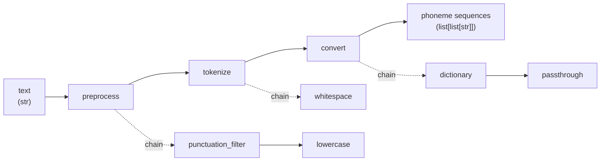
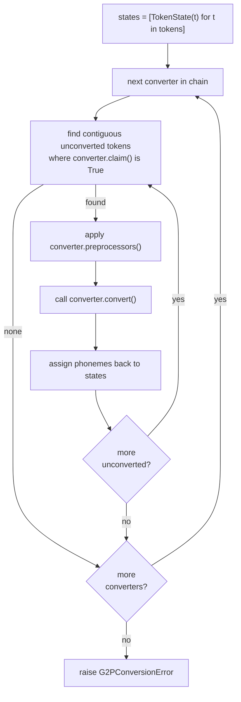

# G2P (Grapheme-to-Phoneme)

A multilingual grapheme-to-phoneme pipeline that converts raw text into phoneme sequences.

## Pipeline



| Stage      | Input                | Output            | Purpose                                                   |
|------------|----------------------|-------------------|-----------------------------------------------------------|
| Preprocess | raw text as `[text]` | modified `[text]` | Clean text before tokenization (lowercase, strip, filter) |
| Tokenize   | `list[str]`          | `list[str]`       | Split text into tokens (words, characters, etc.)          |
| Convert    | `list[str]`          | `list[list[str]]` | Convert tokens to phoneme sequences                       |

Each stage chains configurable components. A stage can have multiple components; each feeds its output to the next.

## Architecture

### Registry

Components are registered via decorators and looked up by ID at construction time.

```python
from g2p.registry import tokenizer, preprocessor, converter

@tokenizer(id="my-tokenizer")
class MyTokenizer(Tokenizer): ...

@preprocessor(id="my-preprocessor")
class MyPreprocessor(Preprocessor): ...

@converter(id="my-converter", language="eng")
class MyConverter(Converter): ...
```

The `language` parameter on `@converter` sets `Converter.language` for compatibility checking. Converters with `language=None` bypass language verification (for generic converters like dictionaries).

### Auto-discovery

Dropping a `.py` file into `g2p/tokenizers/`, `g2p/preprocessors/`, or `g2p/converters/` automatically imports it and fires the decorator — no manual imports needed.

```
g2p/
├── tokenizers/
│   ├── base.py          # Tokenizer ABC, ChainedTokenizer
│   └── simple.py        # WhitespaceTokenizer, CharacterTokenizer, IdentityTokenizer
├── preprocessors/
│   ├── base.py          # Preprocessor ABC, ChainedPreprocessor
│   └── simple.py        # PunctuationFilter, LowercasePreprocessor, StripWhitespacePreprocessor
├── converters/
│   ├── base.py          # Converter ABC, ChainedConverter, G2PConversionError
│   └── simple.py        # DictionaryConverter, PassthroughConverter, CharPhonemeConverter
├── pipeline.py          # G2PPipeline orchestrator
├── api.py               # build_*_from_config()
└── registry.py          # Decorators and lookup functions
```

### Tokenizer

Splits tokens into smaller tokens. A `ChainedTokenizer` feeds each tokenizer's output as input to the next. The first tokenizer in the pipeline receives `[raw_text]`.

**Built-in:**

| ID           | Class                 | Behavior                                                  |
|--------------|-----------------------|-----------------------------------------------------------|
| `whitespace` | `WhitespaceTokenizer` | Split on Unicode whitespace boundaries                    |
| `cjk`        | `CjkTokenizer`        | Split CJK characters individually, group others into runs |
| `character`  | `CharacterTokenizer`  | Split each token into individual characters               |
| `identity`   | `IdentityTokenizer`   | Return tokens unchanged                                   |

### Preprocessor

Transforms a token sequence. Applied before tokenization — receives `[raw_text]` and returns `[modified_text]`.

**Built-in:**

| ID                   | Class                         | Behavior                                         |
|----------------------|-------------------------------|--------------------------------------------------|
| `punctuation_filter` | `PunctuationFilter`           | Remove tokens consisting entirely of punctuation |
| `lowercase`          | `LowercasePreprocessor`       | Lowercase all tokens                             |
| `strip_whitespace`   | `StripWhitespacePreprocessor` | Strip whitespace, remove empty tokens            |

### Converter

Converts tokens to phoneme sequences. Each converter must implement:

- `claim(token) → bool` — whether this converter handles the given token
- `convert(tokens) → list[list[str]]` — convert tokens to phonemes

Optionally override `preprocessors() → list[Preprocessor]` to apply private preprocessors to claimed tokens before `convert()`.

The output is `list[list[str]]`: one phoneme list per input token, in the original order.

**Built-in:**

| ID             | Class                  | Behavior                                                                   |
|----------------|------------------------|----------------------------------------------------------------------------|
| `chain`        | `ChainedConverter`     | Chain converters in priority order; each handles contiguous claimed tokens |
| `dictionary`   | `DictionaryConverter`  | Pronunciation dictionary lookup from a tab-separated file                  |
| `passthrough`  | `PassthroughConverter` | Catch-all: returns each token as its own phoneme                           |
| `char_phoneme` | `CharPhonemeConverter` | One-to-one character-to-phoneme mapping                                    |

#### ChainedConverter algorithm

The chain processes tokens left to right through each sub-converter in priority order.



Any tokens remaining unconverted after all converters raise `G2PConversionError`.

#### DictionaryConverter format

Loads a pronunciation dictionary from a file path. Each line is tab-separated:

```
<word>\t<ph1> <ph2> ...
```

- Multiple pronunciations can appear as duplicate words, or with `(N)` / ` (N)` suffixes: `word`, `word(1)`, `word (2)`, etc.
- Words are case-insensitive
- The first pronunciation variant is returned

Example:
```
hello	hh ax l ow
hello(1)	hh eh l ow
world	w er l d
```

## Configuration

Add a `g2p` block under `binarizer` in your config YAML. It copies to `inference` automatically (same mechanism as `features`).

```yaml
binarizer:
  g2p:
    preprocessors:
      - id: lowercase
    tokenizers:
      - id: whitespace
    converters:
      - id: dictionary
        kwargs:
          path: dictionaries/my_dict.txt
      - id: passthrough
```

### Config schema

```python
class G2PPipelineConfig(ConfigBaseModel):
    preprocessors: list[PreprocessorConfig]   # Applied first, on raw text
    tokenizers: list[TokenizerConfig]         # Chain of tokenizers
    converters: list[ConverterConfig]         # Chain of converters (wraps in ChainedConverter)

class TokenizerConfig(ConfigBaseModel):
    id: str          # Registry ID
    kwargs: dict     # Constructor arguments

class PreprocessorConfig(ConfigBaseModel):
    id: str
    kwargs: dict

class ConverterConfig(ConfigBaseModel):
    id: str
    kwargs: dict
```

String values in `kwargs` that start with `@` are treated as paths relative to the config file's directory. For example, `"@../dicts/cmudict.txt"` with `root_path="configs/g2p/"` resolves to `configs/dicts/cmudict.txt`. This avoids hardcoding absolute paths.

### Programmatic usage

```python
from g2p import G2PPipeline
from g2p.tokenizers.simple import WhitespaceTokenizer
from g2p.preprocessors.simple import LowercasePreprocessor
from g2p.converters.simple import DictionaryConverter, PassthroughConverter

pipeline = G2PPipeline(
    preprocessors=[LowercasePreprocessor()],
    tokenizers=[WhitespaceTokenizer()],
    converters=[DictionaryConverter(path="dict.txt"), PassthroughConverter()],
)

phonemes = pipeline.convert("Hello world")
# → [["hh", "ax", "l", "ow"], ["w", "er", "l", "d"]]
```

Optionally filter converters by language:

```python
pipeline.convert("Hello world", languages=["eng"])
```

Converters with `language=None` always run; converters with a matching language are activated; all others are skipped. Raises `ValueError` if no converter matches.

Or build from config:

```python
from lib.config.schema import G2PPipelineConfig
from g2p.api import build_pipeline_from_config

config = G2PPipelineConfig.model_validate({...})
pipeline = build_pipeline_from_config(config, root_path="configs/")
```

## Adding a custom converter

Drop a file into `g2p/converters/`:

```python
# g2p/converters/my_lang.py
from g2p.registry import converter
from g2p.converters.base import Converter

@converter(id="my-lang", language="xyz")
class MyLangConverter(Converter):
    r"""G2P converter for the XYZ language."""
    
    def __init__(self, some_option: bool = True) -> None:
        self._option = some_option

    def claim(self, token: str) -> bool:
        return True  # or language/character detection

    def convert(self, tokens: list[str]) -> list[list[str]]:
        return [[...] for t in tokens]
```

Then reference it in config:

```yaml
converters:
  - id: my-lang
    kwargs:
      some_option: false
```

No other files need editing. The auto-discovery in `converters/__init__.py` picks it up at import time.
